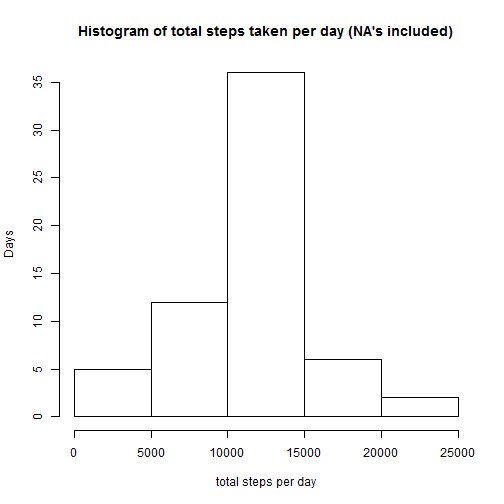
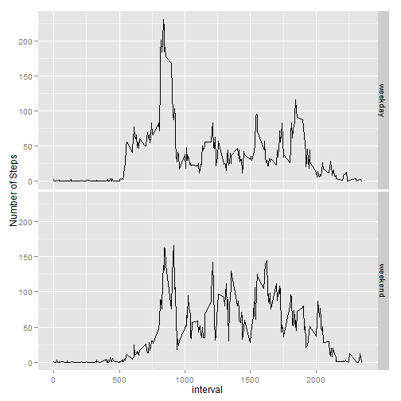

Assignment
-------------------------------------
>Peer-marked assignment 1, for **The Reproducible Research Course** which is part of the Data Science Track; through Coursera: https://www.coursera.org/

Introduction
--------------
It is now possible to collect a large amount of data about personal movement using activity monitoring devices such as a Fitbit, Nike Fuelband, or Jawbone Up. These type of devices are part of the "quantified self" movement -- a group of enthusiasts who take measurements about themselves regularly to improve their health, to find patterns in their behavior, or because they are tech geeks. But these data remain under-utilized both because the raw data are hard to obtain and there is a lack of statistical methods and software for processing and interpreting the data.

This assignment makes use of data from a personal activity monitoring device. This device collects data at 5 minute intervals through out the day. The data consists of two months of data from an anonymous individual collected during the months of October and November, 2012 and include the number of steps taken in 5 minute intervals each day.This analysis follows set instructions, a copy of which is avalible at following link: https://github.com/rdpeng/RepData_PeerAssessment1/. 

>The data used in this analysis was cloned from that repository using "Git". Git was also used to upload the processed data and r-code to my forked repository for this assignement: https://github.com/Marin3r/RepData_PeerAssessment1

Task 1:Loading and Processing the Data
-------------------------------------------------------------------


```r
path <- "../assign01_1"
options(digits = 3)
setwd(path)
zipFile <- "activity.zip"
dataFile <- "activity.csv"
data <- read.csv(unz(zipFile, dataFile),stringsAsFactors=FALSE , header = T)
```
Task 2: Determine the mean total number of steps taken per day.
------------------------------------------------------------------------------
For this part the observations with NA values are ignored.

**1. Histogram of the total number of steps taken each day**


```r
stepsTotal <- aggregate(steps ~ date, data = data, sum, na.rm = TRUE)
hist(stepsTotal$steps, xlab = "total steps per day", ylab = "Days",
	main = paste("Histogram of total steps taken per day"))
```

 


** 2. Calculate and report the mean and median total number of steps taken per day**


```r
cat(sprintf("Mean number of steps taken each day were: %1.0f \n", mean(stepsTotal$steps)))
```

```
## Mean number of steps taken each day were: 10766
```


```r
cat(sprintf("Median number of steps taken each day were: %1.0f\n", median(stepsTotal$steps)))
```

```
## Median number of steps taken each day were: 10765
```

Task 3: What is the average daily activity pattern? 
--------------------------------------------------------------
** 1. Make a time series plot (i.e. type = "l") of the 5-minute interval (x-axis) and the average number of steps taken, averaged across all days (y-axis)**


```r
stepsInterval <- aggregate(steps ~ interval, data = data, mean, na.rm = TRUE)
plot(steps ~ interval, data = stepsInterval, type = "l")
```

 


**2. Which 5-minute interval, on average across all the days in the dataset, contains the maximum number of steps?**


```r
stepsInterval[which.max(stepsInterval$steps), ]$interval
```

```
## [1] 835
```


```r
cat(sprintf("\n5-minute interval with maximum number of steps: %1.0f\n",
	stepsInterval[which.max(stepsInterval$steps), ]$interval))
```

```
## 
## 5-minute interval with maximum number of steps: 835
```


Task 4: Imputing missing values
----------------------------------------------------------------------------------------------
A number of days/intervals have missing values (coded as NA). The presence of missing days may introduce bias into some calculations or summaries of the data.

**1. Calculate and report the total number of missing values in the dataset (i.e. the total number of rows with NAs)**


```r
cat(sprintf("\nTotal number of rows with NAs: %1.0f \n", sum(is.na(data$steps))))
```

```
## 
## Total number of rows with NAs: 2304
```


**2. Devise a strategy for filling in all of the missing values in the dataset**
Strategy followed is to replace NAs with the mean value for that activity obtained from the data set which ignored NAs.

**3. New dataset that is equal to the original dataset but with the missing data filled in.**


```r
dataNew <- merge(data, stepsInterval, by= "interval")
dataNew$stepsIncNa <- with(dataNew, ifelse(!is.na(steps.x),steps.x, steps.y))
```
**4 Analysis the total number of steps taken each day**

*Using a Histogram*


```r
stepsTotalIncNa <- aggregate(stepsIncNa ~ date, data = dataNew, sum, na.rm = TRUE)
hist(stepsTotalIncNa$steps, xlab = "total steps per day", ylab = "Days",
	main = paste("Histogram of total steps taken per day (NA's included)"))
```

 


*By calculating and reporting the mean and median total number of steps taken per day.*


```r
cat(sprintf("Mean number of steps taken each day (NAs included): %1.0f \n",
mean(stepsTotalIncNa$steps)))
```

```
## Mean number of steps taken each day (NAs included): 10766
```

```r
cat(sprintf("Median number of steps taken each day (NAs included): %1.0f\n",
median(stepsTotalIncNa$steps)))
```

```
## Median number of steps taken each day (NAs included): 10766
```


Task 4: analysis for differences in activity patterns between weekdays and weekends.
-----------------------------------------------------------------------------------------
**1. Create a new factor variable in the dataset indicating if it is a weekend or weekday.**


```r
dataNew$day <- weekdays(as.Date(dataNew$date))
dataNew$weekend <- as.factor(with(dataNew, ifelse(day == "Saturday","weekend",
ifelse(day == "Sunday","weekend","weekday"))))
```

Create a panel plot containing a time series plot of the 5-minute interval (x-axis) and the average number of steps taken, averaged across all weekday days or weekend days (y-axis)


```r
stepsTotalIncNa <- aggregate(stepsIncNa ~ interval + weekend, data = dataNew, mean, na.rm = TRUE)
library(ggplot2)
```

```
## Loading required package: methods
```

```r
p <- ggplot(stepsTotalIncNa, aes(x = interval, y=stepsIncNa)) + geom_line()
p + facet_grid(weekend~.) + ylab("Number of Steps")
```

 

